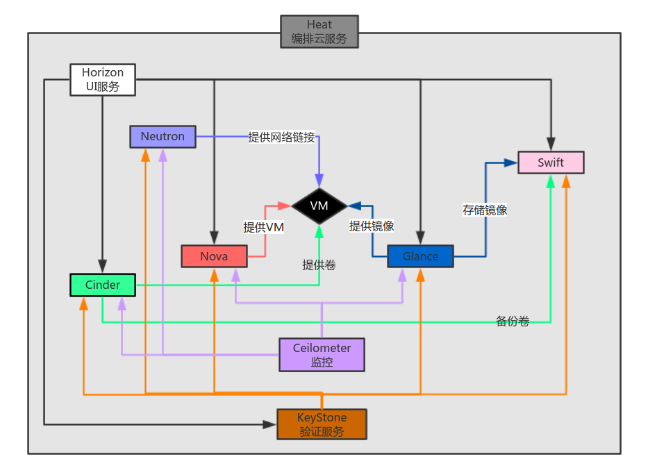
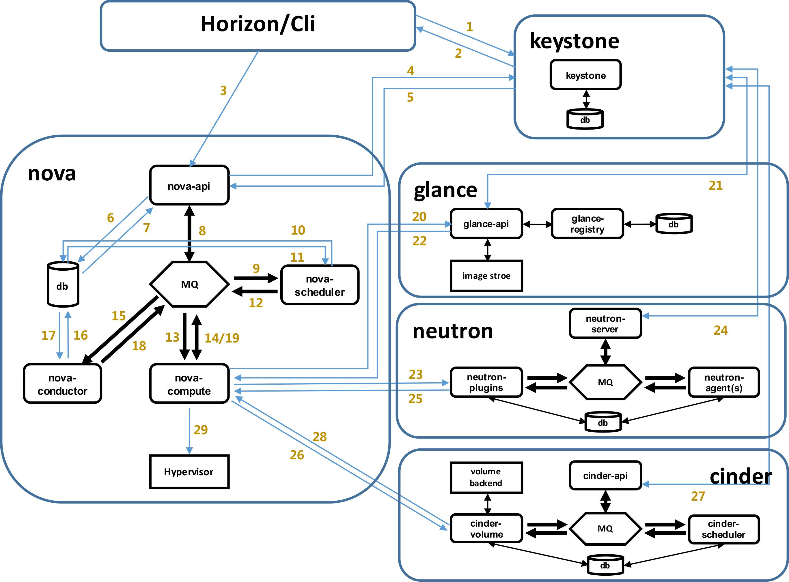

# openstack 

## openstack 简介

OpenStack是一个由NASA（美国国家航空航天局）和Rackspace合作研发并发起的，以Apache许可证授权的自由软件和开放源代码项目。作为一个开源的云计算管理平台项目，旨在为公共及私有云的建设与管理提供软件的开源项目，帮助服务商和企业内部实现类似于 Amazon EC2 和 S3 的云基础架构服务(Infrastructure as a Service, IaaS)。

组件逻辑关系图

## Openstack新建云主机流程图

虚拟机创建过程：

> * (1)界面或命令行通过RESTful API向keystone获取认证信息。
> * (2)keystone通过用户请求认证信息，并生成auth-token返回给对应的认证请求。
> * (3)界面或命令行通过RESTful API向nova-api发送一个boot instance的请求（携带auth-token）。
> * (4)nova-api接受请求后向keystone发送认证请求，查看token是否为有效用户和token。
> * (5)keystone验证token是否有效，如有效则返回有效的认证和对应的角色（注：有些操作需要有角色权限才能操作）。
> * (6)通过认证后nova-api和数据库通讯。
> * (7)初始化新建虚拟机的数据库记录。
> * (8)nova-api通过rpc.call向nova-scheduler请求是否有创建虚拟机的资源(Host ID)。
> * (9)nova-scheduler进程侦听消息队列，获取nova-api的请求。
> * (10)nova-scheduler通过查询nova数据库中计算资源的情况，并通过调度算法计算符合虚拟机创建需要的主机。
> * (11)对于有符合虚拟机创建的主机，nova-scheduler更新数据库中虚拟机对应的物理主机信息。
> * (12)nova-scheduler通过rpc.cast向nova-compute发送对应的创建虚拟机请求的消息。
> * (13)nova-compute会从对应的消息队列中获取创建虚拟机请求的消息。
> * (14)nova-compute通过rpc.call向nova-conductor请求获取虚拟机消息。（Flavor）
> * (15)nova-conductor从消息队队列中拿到nova-compute请求消息。
> * (16)nova-conductor根据消息查询虚拟机对应的信息。
> * (17)nova-conductor从数据库中获得虚拟机对应信息。
> * (18)nova-conductor把虚拟机信息通过消息的方式发送到消息队列中。
> * (19)nova-compute从对应的消息队列中获取虚拟机信息消息。
> * (20)nova-compute通过keystone的RESTfull API拿到认证的token，并通过HTTP请求glance-api获取创建虚拟机所需要镜像。
> * (21)glance-api向keystone认证token是否有效，并返回验证结果。
> * (22)token验证通过，nova-compute获得虚拟机镜像信息(URL)。
> * (23)nova-compute通过keystone的RESTfull API拿到认证k的token，并通过HTTP请求neutron-server获取创建虚拟机所需要的网络信息。
> * (24)neutron-server向keystone认证token是否有效，并返回验证结果。
> * (25)token验证通过，nova-compute获得虚拟机网络信息。
> * (26)nova-compute通过keystone的RESTfull API拿到认证的token，并通过HTTP请求cinder-api获取创建虚拟机所需要的持久化存储信息。
> * (27)cinder-api向keystone认证token是否有效，并返回验证结果。
> * (28)token验证通过，nova-compute获得虚拟机持久化存储信息。
> * (29)nova-compute根据instance的信息调用配置的虚拟化驱动来创建虚拟机。

